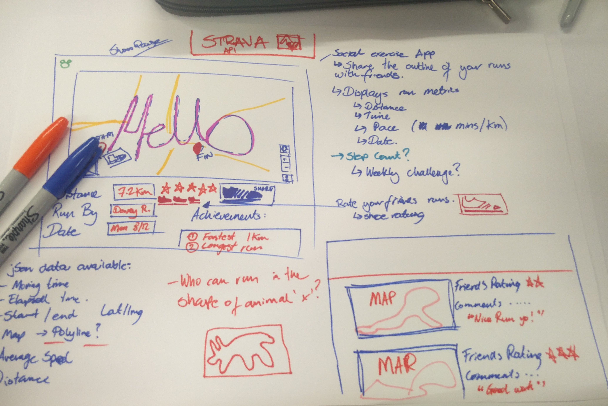
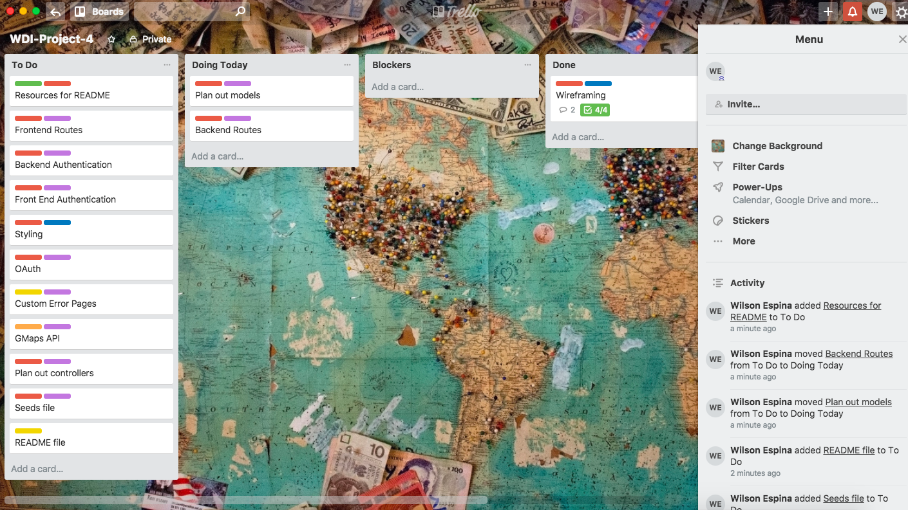

#  WDI Project 4: MERN Stack - 'TRACE'

**[https://running-trace.herokuapp.com/](https://running-trace.herokuapp.com/)**

## SUMMARY

My final project at General Assembly was to create a full MERN stack application with an open scope to create a RESTful site, achievable within a week. My website ended up being a social exercising platform which encourages people to compete and upload the best running traces they’ve saved on [Strava](https://www.strava.com/). I combined map data received from the Strava API and integrated it with the Google Maps API to give a visual representation of run activities. 

The following tech was used in my fourth project:

* Mongo, Express, ReactJS, Node.js
* JSX
* JavaScript
* HTML5
* CSS3
* SASS
* Strava API
* Google Maps API
* Bootstrap
* webpack
* Chai
* Mocha
* enzyme

## PLANNING

### Initial Ideas

During the initial planning phase, I sketched out a fews ideas on paper and investigated the quality of information available from various APIs. I knew I wanted to create something linked to fitness and health and I found that Strava, an app I used regularly, happened to produce detailed JSON information from their API.

In my initial concept, I had originally planned for the app to based around people just submitting any running traces and for the users community to just rate and comment on them. This idea progressed over time, with the  site suggesting predefined 'shapes' that people would try to copy with their runs.

*(Figure 1 - Concept sketch from initial ideas mapping)*

### Project Planning

Throughout the project, I organised sprints by planning and prioritising tasks using Trello. All features and.

*(Figure 2 - Trello board used to plan and monitor the project throughout the week)*

### Wireframe and prototyping

The initial 

Adobe Xd allows users to open up your app on mobile....

*(Figure 3 - Wireframing and protyping on Adobe Xd)*

## FEATURES

### OAuth
CODE SNIPPETS

### Average Rating
CODE SNIPPETS

### Comments

CODE SNIPPETS

The website includes the ability to rate and comment on submitted runs and as well the ability to choose different map styles. This project was a brilliant opportunity  to incorporate smaller features learnt through the course, such as having searching and filtering functionality on the main index page.

## FINAL APP

*(Figure 4 - Screenshots from the final product)*

## FEATURES BACKLOG

Given a weeklong timeframe, the project needed to be scoped to ensure a viable product was submitted on time. In the future, I'll work on adding the follwing features to my site:

1. Make the entire site more mobile responsive.
2. Include multiple Google Maps functionality.
3. Integreate waypoints selector feature on Google Maps to make the app more usuable before recording a run.
4. Include the ability to access bike rides as well as runs.
5. Add extra styling features including rating stars instead of just numbers.
